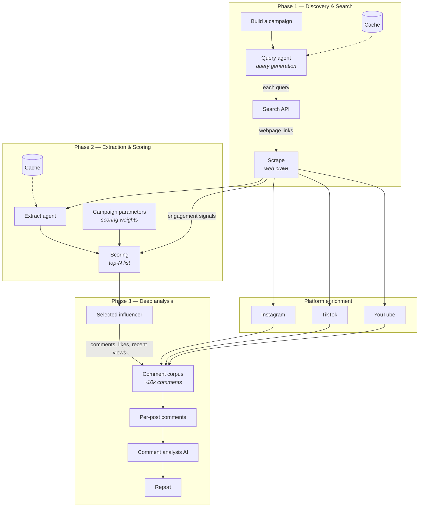
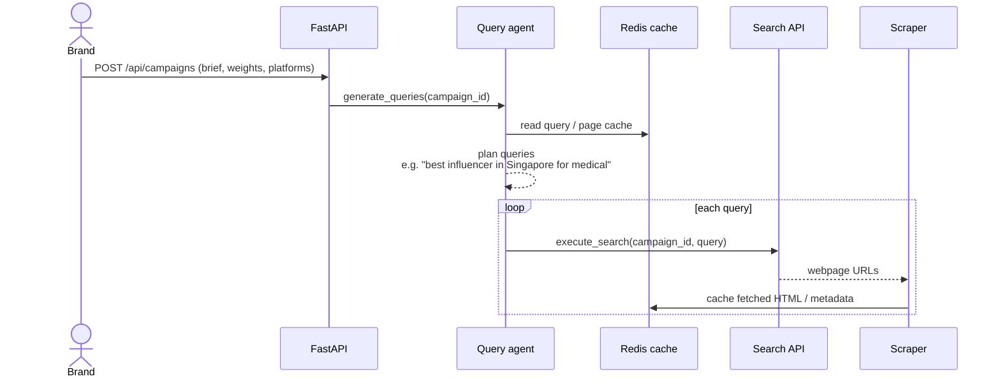
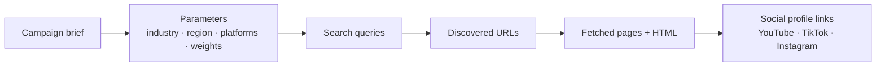
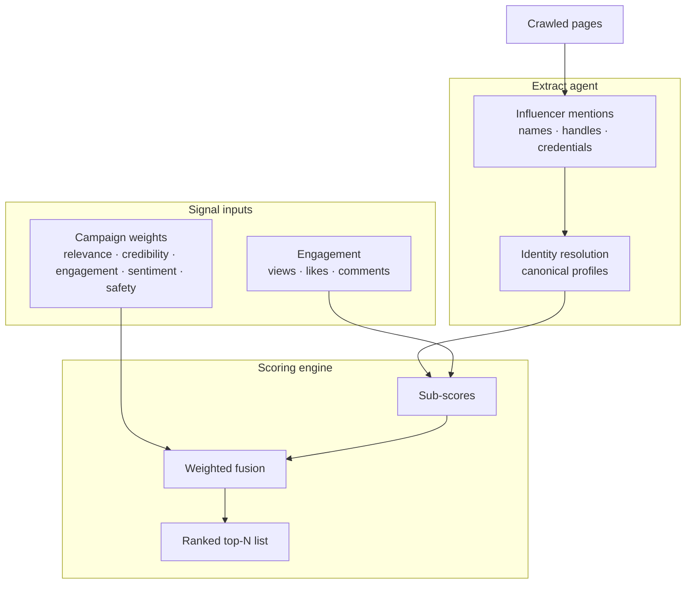
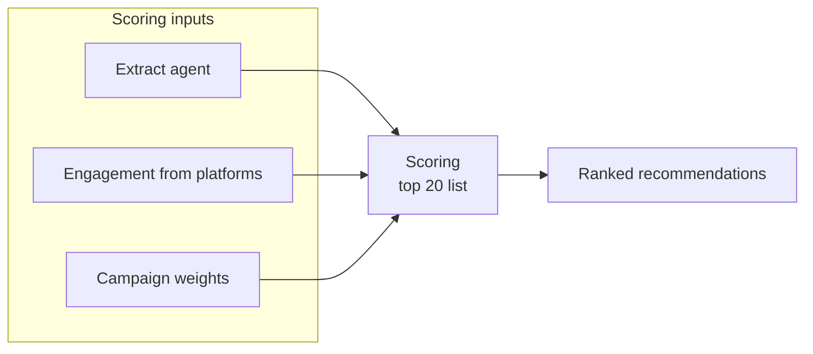
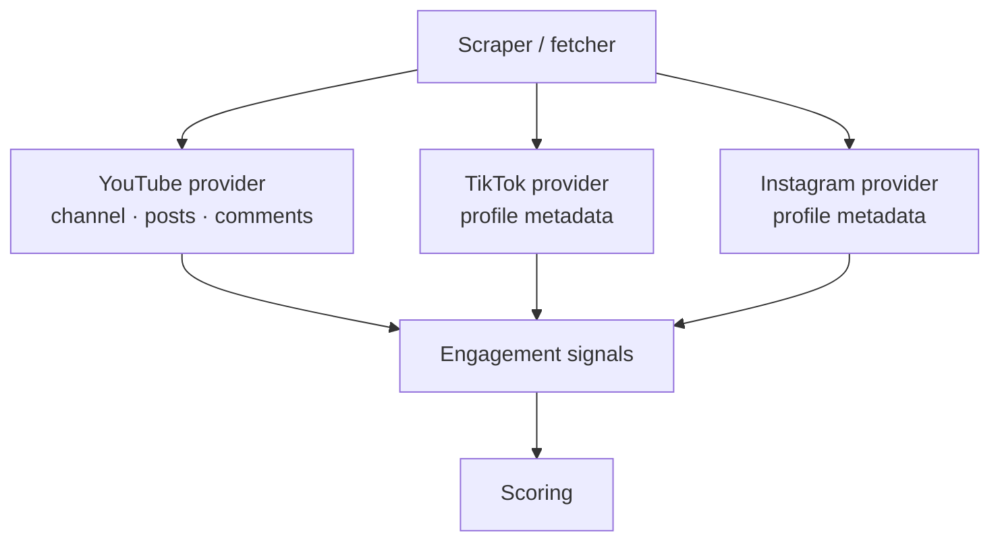
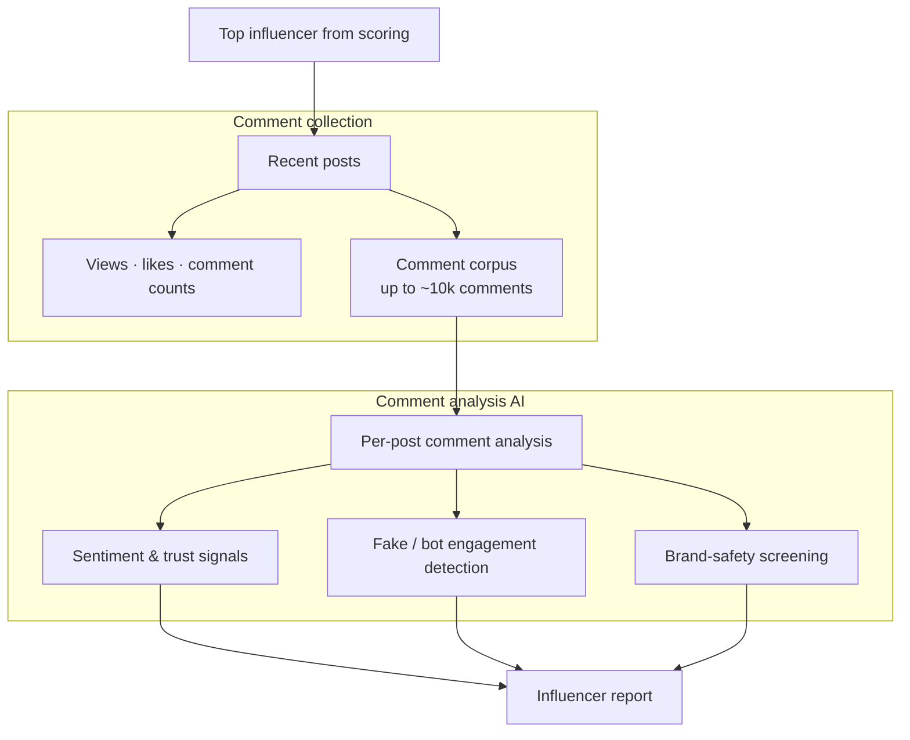
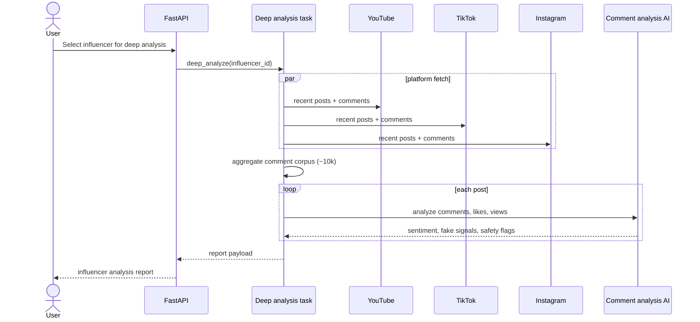
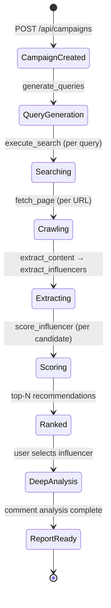
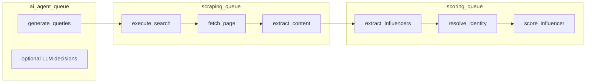

# InfluenceIQ — AI Pipeline Architecture

This document captures the end-to-end influencer discovery and analysis pipeline as designed in the product architecture diagram. It covers two product flows:

1. **Normal search** — discover and rank influencers for a campaign brief.
2. **Deep search** — perform comment-level AI analysis on a selected influencer and produce a report.

For runtime topology, API contracts, and data models, see [architecture.md](./architecture.md).

---

## Overview

---

## Phase 1 — Discovery & Search

The discovery phase turns a brand brief into search queries, finds public web pages, and crawls them for creator signals.

### Components

| Component | Role | Example |
| --- | --- | --- |
| **Build a campaign** | Capture brand brief, target audience, platforms, region, and scoring weights | Medical brand in Singapore, YouTube + Instagram |
| **Query agent** | Generate campaign-specific search queries from the brief | `"best medical influencer Singapore site:youtube.com"` |
| **Cache** | Avoid redundant LLM calls, search results, and page fetches | Redis URL cache, query dedup |
| **Search API** | Execute web search and return candidate URLs | Brave, OpenSerp |
| **Scrape** | Fetch pages, extract readable content, discover social profile links | httpx fetch + content extraction (Firecrawl-style crawl in the target design) |

### Data flow

---

## Phase 2 — Extraction & Scoring

Once pages are crawled, the system extracts influencer mentions, resolves identities, enriches platform engagement, and produces a weighted trust score.

### Scoring inputs

The scoring module combines three upstream paths shown in the diagram:

1. **Extract agent output** — names, handles, credentials, and source provenance from crawled content.
2. **Engagement data** — platform-specific metrics from YouTube, TikTok, and Instagram providers.
3. **Campaign parameters** — per-campaign weight overrides for relevance, credibility, engagement quality, sentiment, and brand safety.

### Platform providers

After scraping discovers social URLs, platform-specific fetchers enrich each candidate:

---

## Phase 3 — Deep Analysis

Deep analysis runs on one or more shortlisted influencers. It collects a large comment corpus (the diagram targets ~10,000 comments), analyzes engagement quality per post, and produces an AI-generated report.

### Deep analysis sequence

### Report outputs

The comment analysis AI produces explainable outputs per influencer:

- Audience sentiment and trust indicators
- Fake or low-quality engagement risk
- Brand-safety concerns with cited evidence
- Per-post breakdowns (views, likes, comment quality)
- Overall recommendation grade with confidence

---

## End-to-end pipeline (both flows)

---

## Worker queue mapping

The pipeline maps onto three Celery queues:

| Diagram component | Celery task / module | Queue |
| --- | --- | --- |
| Query agent | `generate_queries` | `ai_agent_queue` |
| Search API | `execute_search` | `scraping_queue` |
| Scrape | `fetch_page`, `extract_content` | `scraping_queue` |
| Extract agent | `extract_influencers`, `resolve_identity_cluster` | `scoring_queue` |
| Scoring | `score_influencer` | `scoring_queue` |
| Comment analysis AI | `deep_analyze` *(planned)* | TBD |

---

## Implementation status

| Phase | Component | Status |
| --- | --- | --- |
| 1 | Campaign intake | Implemented — `POST /api/campaigns` |
| 1 | Query agent + cache | Implemented — deterministic queries + optional LLM; Redis cache |
| 1 | Search API | Implemented — Brave / OpenSerp with fallback |
| 1 | Scrape / crawl | Implemented — httpx fetch + content extraction |
| 2 | Extract agent | Implemented — spaCy/regex + optional LLM extraction |
| 2 | Platform providers | Partial — YouTube richest; TikTok/Instagram shallow |
| 2 | Weighted scoring | Implemented — fusion engine with campaign weights |
| 3 | Deep analysis (10k comments) | **Not yet implemented** — analyzers exist but are not wired to real comment data |
| 3 | Report generation | **Not yet implemented** |

See [Status-Report.md](./Status-Report.md) for a detailed gap analysis.

---
