# InfluenceIQ — AI Pipeline Architecture

This document captures the **execution flow** for influencer discovery and analysis: phases, Celery tasks, queues, and data movement through the pipeline.

It covers two product flows:

1. **Normal search** — discover and rank influencers for a campaign brief.
2. **Deep search** — perform comment-level AI analysis on a selected influencer and produce a report.

**How this doc relates to others**

| Document | Scope |
| --- | --- |
| **[architecture.md](./architecture.md)** | System source of truth — REST/WebSocket contracts, campaign lifecycle (create, submit, **rerun**, cancel), data models |
| **This doc** | What happens **once the pipeline is dispatched** — `generate_queries` through scoring and optional deep analysis |
| [development.md](./development.md) | Local setup and day-to-day dev workflow |

**Running a campaign** spans both layers: the API persists the brief and chooses *when* to start (or restart); this document describes *what runs* after `start_campaign` enqueues `generate_queries`.

---

## Overview

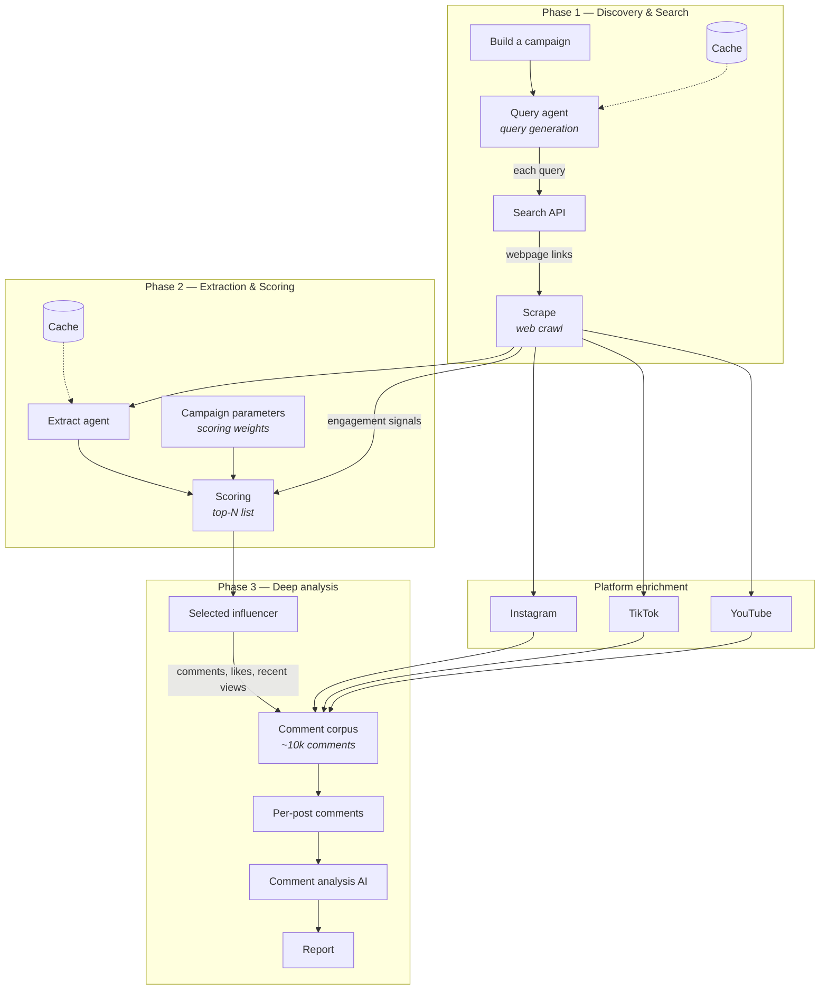

---

## Phase 1 — Discovery & Search

The discovery phase turns a brand brief into search queries, finds public web pages, and crawls them for creator signals.

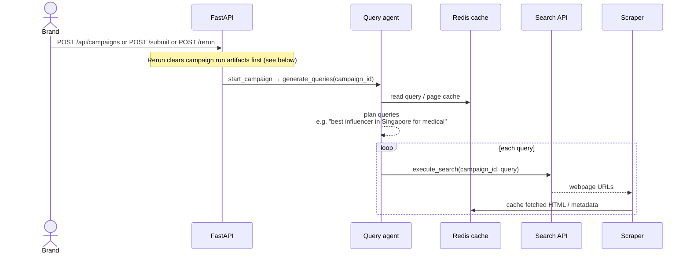

### Components

| Component | Role | Example |
| --- | --- | --- |
| **Build a campaign** | Capture brand brief, target audience, platforms, region, and scoring weights | Medical brand in Singapore, YouTube + Instagram |
| **Pipeline dispatch** | Commit lifecycle state and enqueue the root task | `start_campaign` → `generate_queries.delay` |
| **Query agent** | Generate campaign-specific search queries from the brief | `"best medical influencer Singapore site:youtube.com"` |
| **Cache** | Avoid redundant LLM calls, search results, and page fetches | Redis URL cache (global), query dedup; campaign-scoped pipeline state |
| **Search API** | Execute web search and return candidate URLs | Brave, OpenSerp |
| **Scrape** | Fetch pages, extract readable content, discover social profile links | httpx fetch + content extraction (Firecrawl-style crawl in the target design) |

### Pipeline entry points

All normal-search runs converge on the same execution graph after dispatch:

| Trigger | API | When to use |
| --- | --- | --- |
| **Create + start** | `POST /api/campaigns` (`start_pipeline=true`) | New brief, run immediately |
| **Submit draft** | `POST /api/campaigns/{id}/submit` | Saved draft, first run |
| **Quick rerun** | `POST /api/campaigns/{id}/rerun?start_pipeline=true` | Terminal campaign (`completed`, `failed`, `cancelled`, `partial`); same brief, fresh pipeline on same `campaign_id` |
| **Edit & rerun** | `POST /api/campaigns/{id}/rerun?start_pipeline=false` then `PATCH` + `submit` | Change brief before the next run |

Rerun does **not** create a new campaign row. It clears the previous run's outputs and re-enters at **Query generation** (see [Rerunning a campaign](#rerunning-a-campaign)).

### Data flow

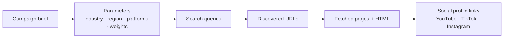

---

## Phase 2 — Extraction & Scoring

Once pages are crawled, the system extracts influencer mentions, resolves identities, enriches platform engagement, and produces a weighted trust score.

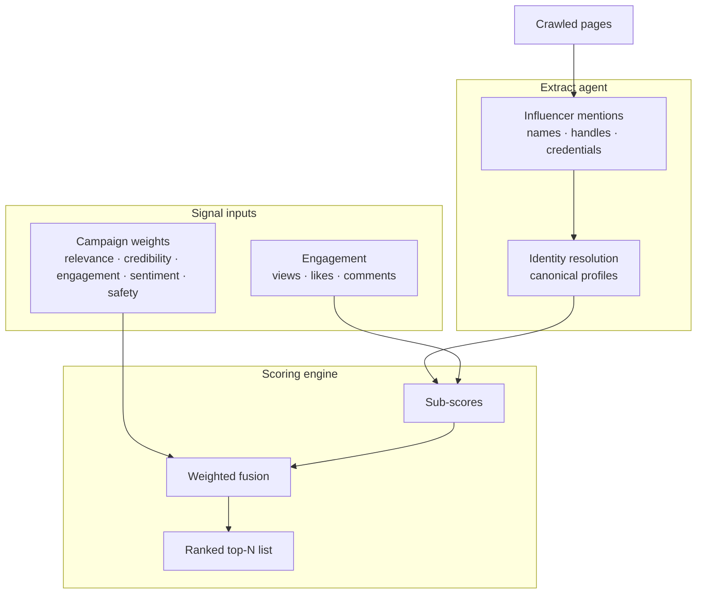

### Scoring inputs

The scoring module combines three upstream paths shown in the diagram:

1. **Extract agent output** — names, handles, credentials, and source provenance from crawled content.
2. **Engagement data** — platform-specific metrics from YouTube, TikTok, and Instagram providers.
3. **Campaign parameters** — per-campaign weight overrides for relevance, credibility, engagement quality, sentiment, and brand safety.

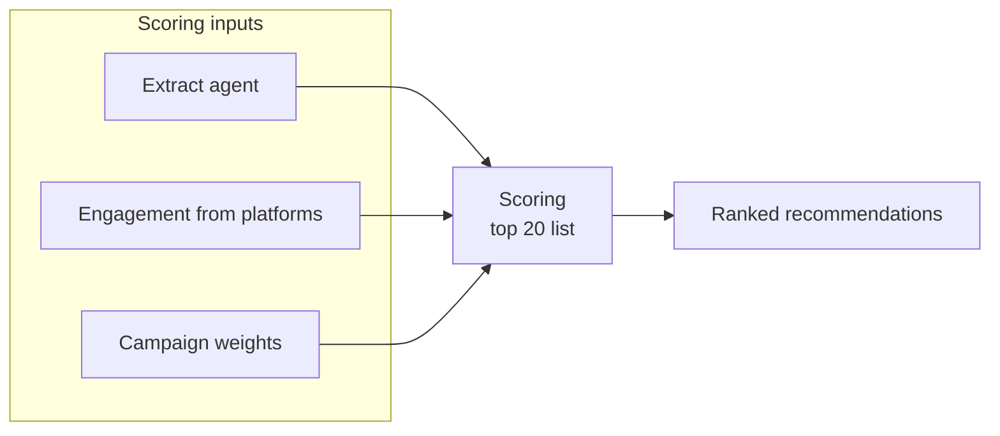

### Platform providers

After scraping discovers social URLs, platform-specific fetchers enrich each candidate:

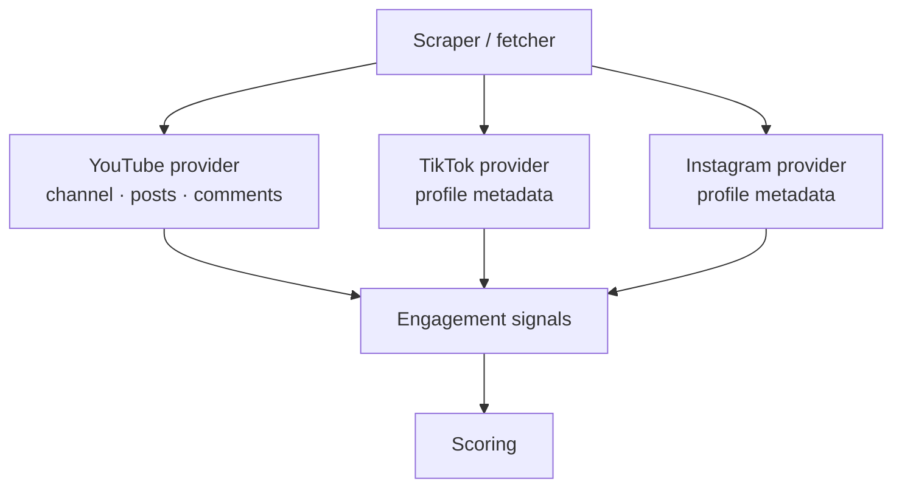

---

## Phase 3 — Deep Analysis

Deep analysis runs on one or more shortlisted influencers. It collects a large comment corpus (the diagram targets ~10,000 comments), analyzes engagement quality per post, and produces an AI-generated report.

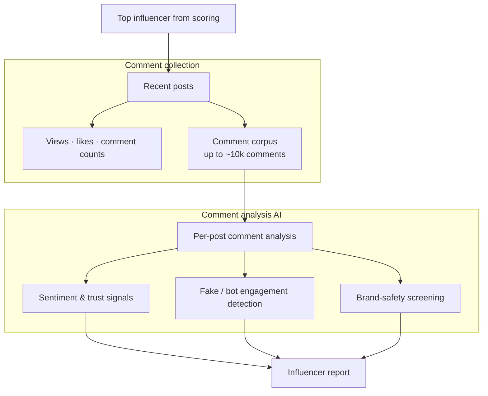

### Deep analysis sequence

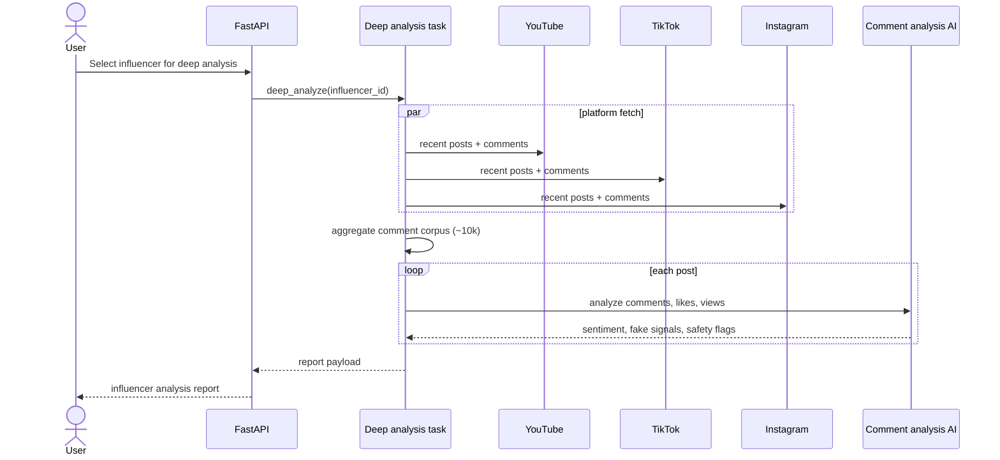

### Report outputs

The comment analysis AI produces explainable outputs per influencer:

- Audience sentiment and trust indicators
- Fake or low-quality engagement risk
- Brand-safety concerns with cited evidence
- Per-post breakdowns (views, likes, comment quality)
- Overall recommendation grade with confidence

---

## End-to-end pipeline (both flows)

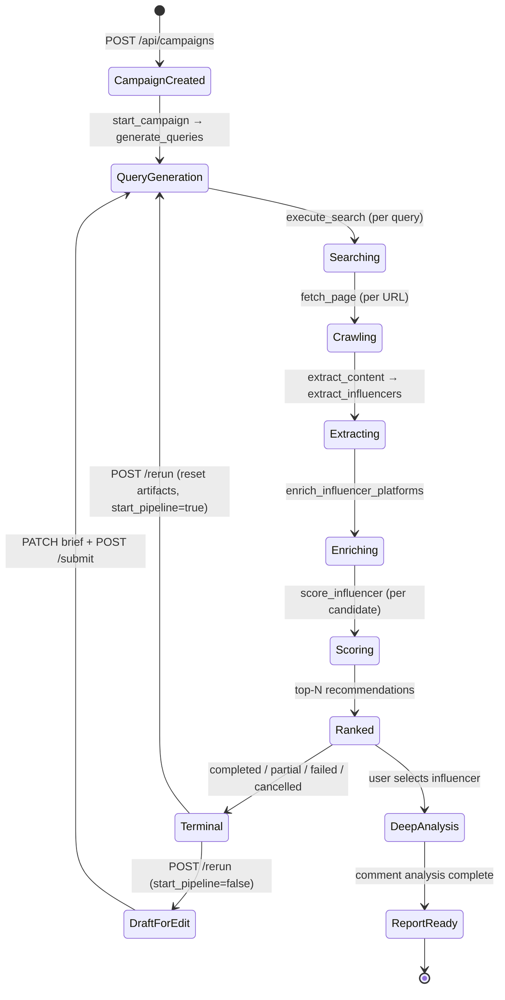

Phase 1–2 (normal search) ends at **Terminal**. **Rerun** loops back to **QueryGeneration** on the same `campaign_id` after clearing run-scoped data. Phase 3 (deep analysis) remains user-triggered and is not started automatically by rerun.

---

## Rerunning a campaign

Rerun replays the **same execution graph** as a first run. The lifecycle layer (`POST /rerun` in [architecture.md](./architecture.md)) handles reset and dispatch; the pipeline layer is unchanged after `generate_queries` starts.

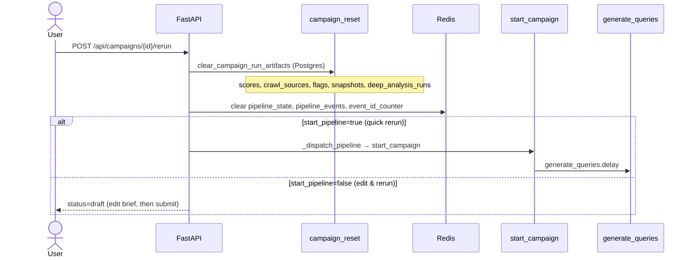

### What rerun clears vs preserves

| Layer | Cleared on rerun | Preserved |
| --- | --- | --- |
| **Postgres (run artifacts)** | `crawl_sources`, `influencer_scores`, `brand_safety_flags`, `candidate_snapshots`, `deep_analysis_runs` | `campaigns` row (brief, weights), `campaign_contracts`, `saved_list_items`, global `influencers` |
| **Redis (campaign-scoped)** | `pipeline_state:{id}`, `pipeline_events:{id}`, `event_id_counter:{id}` | — |
| **Redis (global)** | — | URL/page cache (`url_cache:*`) — reruns may skip re-fetching unchanged pages |

Clearing run artifacts is required: `refresh_campaign_status` derives completion from Postgres. Re-dispatching without deleting old scores and extracted sources can mark the campaign **completed** before new work finishes.

Global URL cache is **intentionally kept** for faster reruns. If a bad run was caused by stale cached pages, operators may need cache eviction separately; that is not part of the default rerun path.

### Outreach guard

If the campaign has shortlisted or contracted creators, quick rerun (`start_pipeline=true`) returns `409 rerun_has_outreach` unless the client sends `X-Confirm-Rerun: true`. Contracts and saved-list items are kept; only match results are replaced.

---

## Worker queue mapping

The pipeline maps onto three Celery queues:

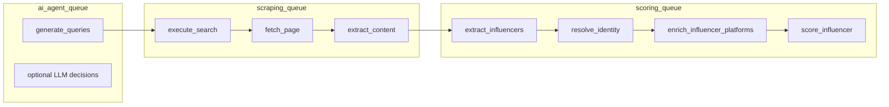

| Diagram component | Celery task / module | Queue |
| --- | --- | --- |
| Query agent | `generate_queries` | `ai_agent_queue` |
| Search API | `execute_search` | `scraping_queue` |
| Scrape | `fetch_page`, `extract_content` | `scraping_queue` |
| Extract agent | `extract_influencers`, `resolve_identity_cluster` | `scoring_queue` |
| Platform enrichment | `enrich_influencer_platforms` | `scoring_queue` |
| Scoring | `score_influencer` | `scoring_queue` |
| Campaign rerun | `POST /rerun` → reset + `start_campaign` | API / orchestrator |
| Comment analysis AI | `deep_analyze` *(planned)* | TBD |

---

## Implementation status

| Phase | Component | Status |
| --- | --- | --- |
| 1 | Campaign intake | Implemented — `POST /api/campaigns` |
| 1 | Campaign rerun | Implemented — `POST /api/campaigns/{id}/rerun` (see [Rerunning a campaign](#rerunning-a-campaign)) |
| 1 | Query agent + cache | Implemented — deterministic queries + optional LLM; Redis cache |
| 1 | Search API | Implemented — Brave / OpenSerp with fallback |
| 1 | Scrape / crawl | Implemented — httpx fetch + content extraction |
| 2 | Extract agent | Implemented — spaCy/regex + optional LLM extraction |
| 2 | Platform providers | Partial — YouTube richest; TikTok/Instagram shallow |
| 2 | Weighted scoring | Implemented — fusion engine with campaign weights |
| 3 | Deep analysis (10k comments) | **Not yet implemented** — analyzers exist but are not wired to real comment data |
| 3 | Report generation | **Not yet implemented** |

See [Status-Report.md](./Status-Report.md) for a detailed gap analysis.

---
