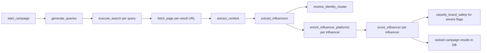
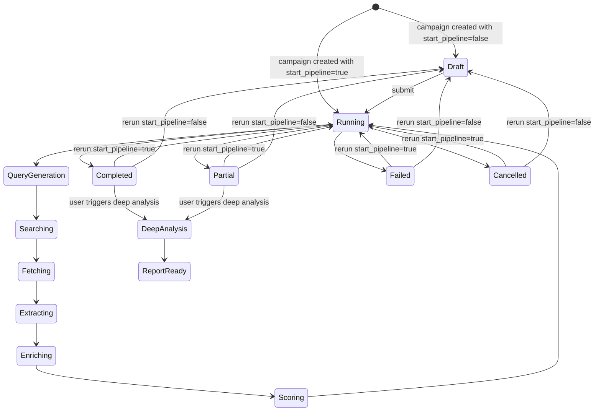

# InfluenceIQ Pipeline Flow Architecture

This document describes the pipeline that exists in the current repository: the async campaign execution flow, the Redis state/event model around it, and the separate deep-analysis flow that can be triggered after ranking.

Use [architecture.md](./architecture.md) for the broader system map. Use this document when you need to understand what actually runs after a campaign is dispatched.

## Scope

This doc covers two related but separate flows:

1. the main campaign discovery and scoring pipeline
2. the on-demand deep-analysis pipeline for one influencer in one campaign

It also covers:

- Celery queue routing
- Redis pipeline state and event replay
- rerun/reset behavior
- terminal status resolution

## Main Campaign Pipeline

The canonical async entrypoint is:

- `backend.pipeline.tasks.orchestrator.start_campaign(campaign_id)`

That entrypoint is called by:

- `POST /api/campaigns` when `start_pipeline=true`
- `POST /api/campaigns/{id}/submit`
- `POST /api/campaigns/{id}/rerun?start_pipeline=true`

It does three things before any heavy work starts:

1. computes and persists the campaign embedding when possible
2. initializes Redis pipeline state
3. emits `campaign.started` and dispatches `generate_queries`

## Queue Topology

Queue routing is defined in `backend/core/celery/roles.py`.

| Queue | Current tasks | Why it exists |
| --- | --- | --- |
| `ai_agent_queue` | `generate_queries`, `resolve_identity_llm`, `classify_brand_safety`, `deep_analyze` | LLM-heavy or coordination-heavy work |
| `scraping_queue` | `execute_search`, `fetch_page`, `extract_content`, `enrich_influencer_platforms` | HTTP and provider I/O |
| `scoring_queue` | `extract_influencers`, `resolve_identity_cluster`, `score_influencer` | extraction, clustering, scoring, DB writes |

The backend and workers all share the same Celery app in `backend/core/celery/app.py`; the process command decides which queues a given worker consumes.

## End-to-End Execution Flow

Two details matter here:

- identity clustering is campaign-wide side work triggered after extraction, not a blocking gate before enrichment
- scoring is triggered from enrichment, and enrichment intentionally enqueues scoring even when provider collection fails or times out

## Stage-by-Stage Detail

### 1. Query Generation

Task:

- `backend.pipeline.tasks.search.generate_queries`

Inputs:

- `Campaign.search_query`
- `Campaign.preferred_platforms`
- `Campaign.brief_snapshot.locations`

Behavior:

- marks the campaign as running if needed
- builds a query payload from the campaign row
- tries LLM-based planning when `AI_AGENT_LLM_QUERY_PLANNING` is enabled
- otherwise falls back to deterministic query construction
- deduplicates near-identical queries
- forces location coverage when a target location exists
- forces platform coverage for preferred platforms
- dispatches one `execute_search` task per generated query

Current constraints:

- query count is capped at `5`
- location targeting is treated as a hard constraint when present
- platform hints are injected into queries if missing

Events and state:

- sets Redis phase to `query_generation`
- emits `query.generation.completed`

## 2. Search Execution

Task:

- `backend.pipeline.tasks.search.execute_search`

Behavior:

- calls `search_web(...)`
- stores each result URL as a `CrawlSource` row for the campaign
- deduplicates URLs per `(campaign_id, url)`
- updates durable campaign status via `refresh_campaign_status`
- dispatches `fetch_page` for each crawl source

Important implementation detail:

- the Redis `urls_discovered` field starts as query count during query generation, then is overwritten with total `CrawlSource` count once search results are materialized

Events and state:

- emits `search.executed`
- emits `search.failed` on provider failure
- updates `urls_discovered`

## 3. Page Fetch

Task:

- `backend.pipeline.tasks.crawl.fetch_page`

Behavior:

- loads the `CrawlSource`
- fetches raw page HTML through `backend.pipeline.content.fetcher.fetch_url`
- retries transient failures up to the task retry limit
- stores HTML and fetch metadata on the source row
- marks the source `scraped`
- dispatches `extract_content`

Failure handling:

- persistent fetch failures mark the source `failed`
- source failures increment `urls_failed`
- crawl failures can contribute to a terminal campaign `failed` or `partial` status later

Events and state:

- emits `page.fetched`
- increments `urls_scraped`
- increments `urls_processed` alongside `urls_scraped`

## 4. Content Extraction

Task:

- `backend.pipeline.tasks.crawl.extract_content`

Behavior:

- parses the fetched page with `extract_role4_content`
- stores extracted text, title, and lightweight metrics back on the `CrawlSource`
- marks the source `extracted`
- dispatches `extract_influencers`

Events:

- emits `content.extracted`

## 5. Influencer Extraction

Task:

- `backend.pipeline.tasks.extract.extract_influencers`

Behavior:

- extracts mentions from page content
- optionally uses the LLM path for handle extraction
- optionally verifies candidate social profile links with an LLM gate
- canonicalizes extracted candidates
- creates or updates `Influencer` rows
- writes `CrawlSourceInfluencer` attribution rows
- persists credential evidence when present
- updates the legacy `CrawlSource.influencer_id` shortcut when possible

What happens next:

- triggers campaign-wide `resolve_identity_cluster`
- dispatches `enrich_influencer_platforms` once per discovered influencer for that source

State semantics:

- `influencers_found` is incremented by the count of newly created canonical influencers, not by raw mention count

Events:

- emits `influencer.found`
- emits `influencers.none` when a page yields no creator mentions
- emits `extract.failed` on extraction failure

## 6. Identity Clustering

Task:

- `backend.pipeline.tasks.extract.resolve_identity_cluster`

Behavior:

- loads all campaign-linked influencers
- runs cluster resolution over the current campaign set
- auto-merges high-confidence matches
- persists merge records through the identity persistence layer
- can dispatch `resolve_identity_llm` for ambiguous cases when the flag is enabled

This is a cleanup/consolidation pass. It is not the root driver of the pipeline and does not replace the per-page extraction flow.

## 7. Platform Enrichment

Task:

- `backend.pipeline.tasks.enrich.enrich_influencer_platforms`

Behavior:

- gathers platform URLs for one influencer
- fetches structured profile data for supported platforms
- persists `PlatformProfile` and `PlatformPost` data
- computes and persists embeddings when profile enrichment succeeds
- optionally fetches recent post comments when `COMMENT_FETCH_ON_ENRICH=true`

Current failure policy:

- enrichment has a `soft_time_limit` of `300` seconds
- even on provider failure, DB error, or timeout, the task still dispatches scoring
- this is intentional so one bad provider call cannot strand an influencer and freeze a whole campaign

Current counters:

- increments `platforms_enriched`
- increments `enrichment_failed` when some provider work fails

Events:

- emits `platform.enriched`

## 8. Scoring

Task:

- `backend.pipeline.tasks.score.score_influencer`

Behavior:

- builds a campaign-contextual candidate object
- persists a `CandidateSnapshot`
- runs `run_role4_pipeline(...)`
- persists a versioned `InfluencerScore`
- marks previous current score rows non-current on rescore
- emits the main ranking event

Important implementation details:

- scoring uses a PostgreSQL advisory lock keyed by `(campaign_id, influencer_id)` to prevent concurrent “current score” races
- scoring is allowed to run with incomplete platform data; it degrades to other evidence rather than aborting
- only severe brand-safety findings enqueue downstream classification tasks

Events and state:

- emits `score.calculated`
- increments `scores_computed`
- can enqueue `classify_brand_safety`

## 9. Brand Safety Classification

Task:

- `backend.pipeline.tasks.score.classify_brand_safety`

Behavior:

- scans text using the deterministic brand-safety blocklist path
- persists `BrandSafetyFlag` rows
- marks whether LLM review would be useful, but deterministic persistence happens first

Events:

- emits `brand_safety.flagged`

## Campaign Status Resolution

Redis state tracks live counters and phase, but durable lifecycle status is derived from the database by `refresh_campaign_status(...)`.

Current terminal rules are:

- `running`
  - sources still pending or only partially processed
  - no influencers yet but not all sources failed
  - not all discovered influencers have been scored
- `failed`
  - all sources failed and no scoring was produced
- `partial`
  - some sources failed, but scoring completed for at least part of the campaign
- `completed`
  - all required sources and influencer scores are complete without failed-source partiality

Lifecycle events emitted from this resolution path include:

- `campaign.completed`
- `campaign.partial`
- `campaign.failed`

Cancellation is handled separately by `cancel_campaign(...)`, which emits:

- `campaign.cancelled`

## Redis State Model

Pipeline state is stored as a Redis hash under:

- `pipeline_state:{campaign_id}` via the `STATE_KEY_PREFIX`

Current documented fields include:

- `campaign_id`
- `status`
- `phase`
- `urls_discovered`
- `urls_scraped`
- `urls_processed`
- `urls_failed`
- `influencers_found`
- `scores_computed`
- `platforms_enriched`
- `enrichment_failed`

Current TTL:

- `7200` seconds for pipeline state

The API `GET /api/campaigns/{id}/state` does not blindly trust Redis. It reconciles Redis counters with DB-derived counts so reruns or partial cache clears do not leave the UI showing stale zeros while results still exist in PostgreSQL.

It also adds:

- `last_event_id`

That value comes from the Redis event counter and is used by WebSocket clients to resume from a known event boundary.

## Event Replay Model

Workflow events are stored in Redis in two forms:

- replay log list: `pipeline_events:{campaign_id}`
- monotonically increasing counter: `event_id_counter:{campaign_id}`

Each event has:

- `event_id`
- `type`
- `campaign_id`
- `timestamp`
- `payload`

Current event TTL:

- `3600` seconds

The WebSocket flow is:

1. client connects to `/ws/campaign/{campaign_id}?last_event_id=N`
2. server replays every stored event with `event_id > N`
3. server subscribes to the live pub/sub channel `campaign:{campaign_id}`
4. server emits periodic `heartbeat` frames with the latest pipeline state snapshot

This means the replay window is transient and Redis-backed; durable business results still live in PostgreSQL.

## Rerunning a Campaign

Rerun behavior is implemented through:

- `backend.api.routers.campaigns.rerun_campaign`
- `backend.pipeline.campaign_reset.clear_campaign_run_artifacts`
- `backend.pipeline.campaign_reset.reset_campaign_lifecycle`

### What rerun deletes

For the target campaign only, rerun clears:

- `BrandSafetyFlag`
- `DeepAnalysisRun`
- `CandidateSnapshot`
- `InfluencerScore`
- `CrawlSourceInfluencer`
- `CrawlSource`

### What rerun preserves

Rerun does not delete:

- the `Campaign` row itself
- canonical global `Influencer` rows
- `SavedListItem` rows
- `CampaignContract` rows

### Rerun modes

`POST /api/campaigns/{id}/rerun?start_pipeline=true`

- clears run artifacts
- resets lifecycle to `running`
- clears Redis campaign pipeline cache
- dispatches the full pipeline again on the same `campaign_id`

`POST /api/campaigns/{id}/rerun?start_pipeline=false`

- clears run artifacts
- resets lifecycle to `draft`
- clears Redis campaign pipeline cache
- does not dispatch work until a later `PATCH` plus `POST /submit`

If the campaign has shortlisted or contracted creators, quick rerun requires explicit confirmation at the API level.

## Deep Analysis Pipeline

Deep analysis is not part of the automatic main campaign pipeline. It is a user-triggered async workflow for one `(campaign_id, influencer_id)` pair.

API surface:

- `POST /api/influencers/{id}/deep-analysis`
- `GET /api/influencers/{id}/deep-analysis/latest`
- `GET /api/influencers/{id}/deep-analysis/{run_id}`
- `GET /api/influencers/{id}/reports/{report_id}`

Task:

- `backend.pipeline.tasks.deep.deep_analyze`

Queue:

- `ai_agent_queue`

### Deep-analysis stages

The current task runs these internal stages:

1. `collect_social_content`
2. `collect_post_comments`
3. `collect_external_signals`
4. `synthesize_report`

### Current defaults

- default `comment_target`: `2000`
- allowed `comment_target` range: `100` to `10000`
- requested post limit: `20`
- requested per-post comment limit: `200`
- cache freshness window for successful reports: `30` minutes

### Persistence model

Deep analysis writes:

- `DeepAnalysisRun`
- `DeepAnalysisPostResult`
- `DeepAnalysisReport`

It also updates:

- `DeepAnalysisRun.current_stage`
- `DeepAnalysisRun.collected_comment_count`
- `DeepAnalysisRun.coverage_summary`

### Events

Deep analysis emits:

- `deep_analysis.started`
- `deep_analysis.social_collected`
- `deep_analysis.comments_collected`
- `deep_analysis.external_signals_collected`
- `deep_analysis.report_ready`
- `deep_analysis.failed`

After a successful report, the backend enqueues a normal `score_influencer` rescore so richer evidence can affect the main campaign ranking data.

## State Diagram

## Related Docs

- [architecture.md](./architecture.md)
- [provider-configuration.md](./provider-configuration.md)
- [development.md](./development.md)
