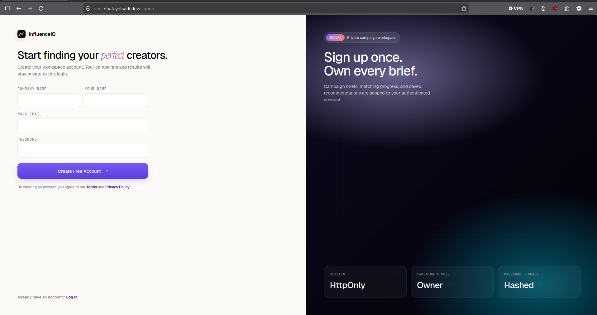
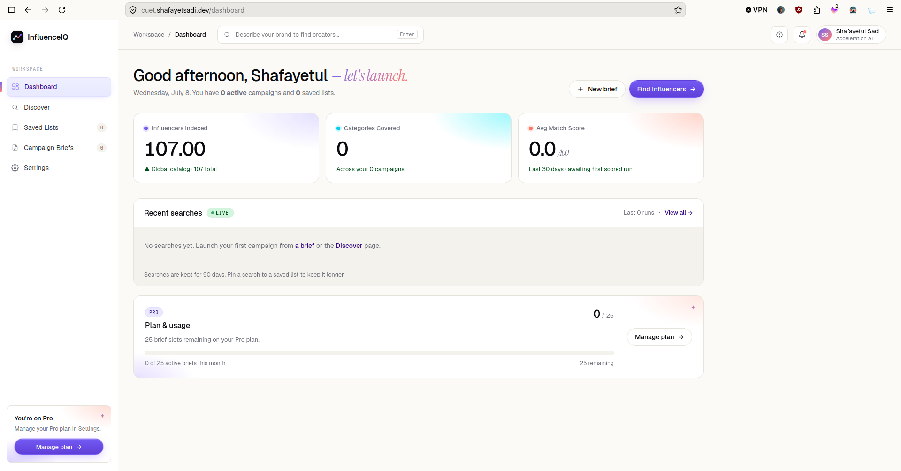
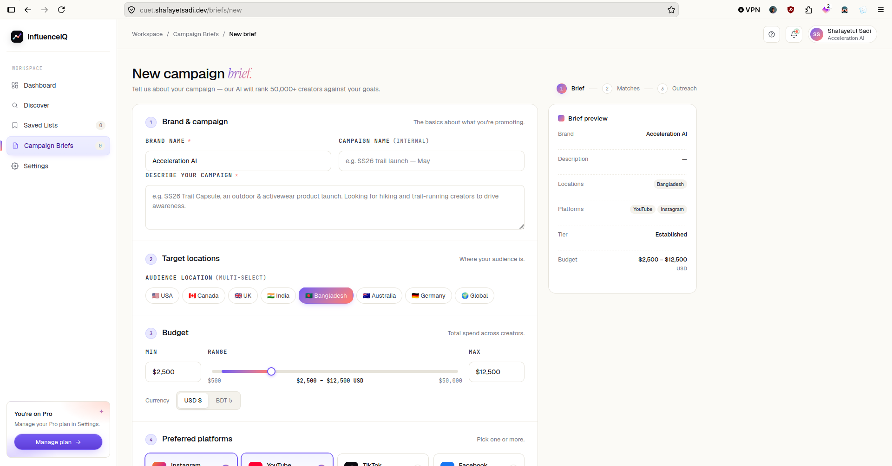
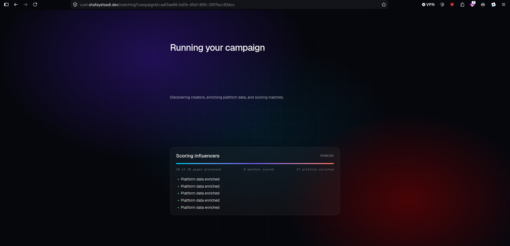
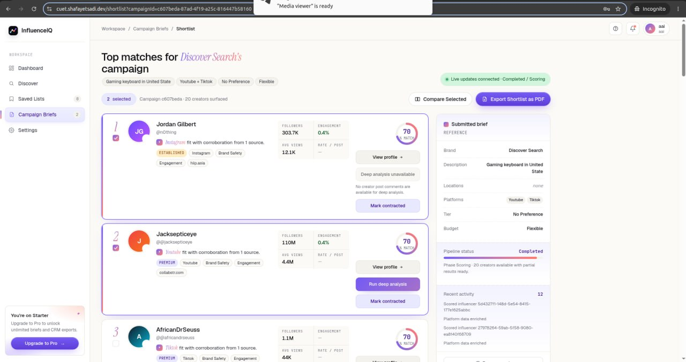
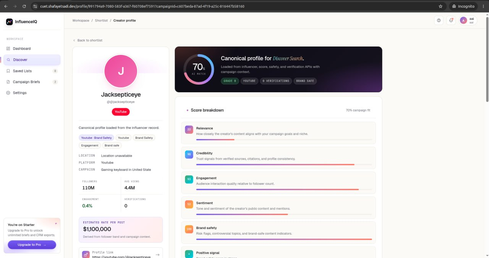
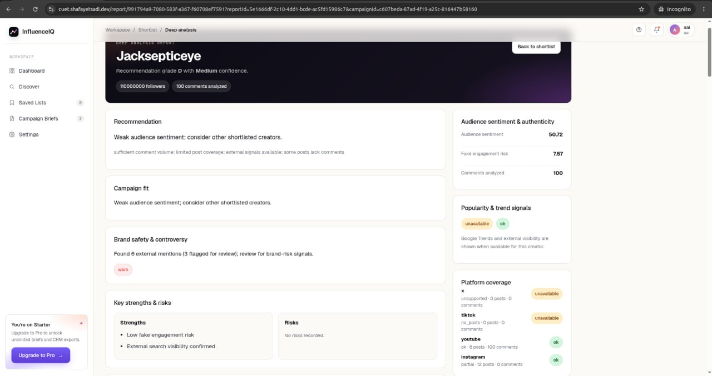

**Team:** sudo_make_it_work · **Institution:** RUET · **Track:** D — Open Innovation

**Team Lead:** MD Tonmoy Hossain Jifat (tonmoyhossainjifat313@gmail.com, 01987476056)

**Members:** MD Tonmoy Hossain Jifat, Shafayetul Huda Sadi, Adib Hasan, Mahmudul Hasan

**Live demo:** https://cuet.shafayetsadi.dev/ · **Repository:** https://github.com/md-tonmoy007/InfluenceIQ

---

## 1. The Problem

Imagine a small brand preparing to launch a new skincare product. The marketing team has a limited budget, a short timeline, and a simple goal: find a few creators who can genuinely influence the right audience. They open Instagram, YouTube, TikTok, and X, search for “top beauty creators,” and quickly find dozens of promising profiles. On the surface, many of them look perfect: high follower counts, attractive engagement numbers, polished content, and active audiences.

But after a few hours of manual checking, the real uncertainty begins.

Are those followers genuine, or are they inflated by fake accounts?  
Are the comments authentic, or are they repetitive and spam-driven?  
Is the creator actually aligned with the campaign, or just broadly popular?  
Could there be brand-safety concerns hidden behind good-looking numbers?  
And if the team finally chooses someone, can they later explain _why_ that creator was the right pick?

This is the core problem with modern influencer selection: brands often make expensive decisions using visibility metrics as a shortcut for trust.

That creates four practical problems:

1. **Inflated influence:** fake followers, spam comments, and bot-like engagement can make some creators appear stronger than they really are.
2. **Hidden risk:** a creator may have reach but still be brand-unsafe because of toxic, misleading, or low-trust content patterns.
3. **Slow research:** manually checking candidates across articles, YouTube, Instagram, TikTok, and X takes too much time and does not scale.
4. **Poor auditability:** teams often cannot clearly explain later why a creator was selected or rejected.

InfluenceIQ was built to solve this gap by turning influencer discovery into a more evidence-based, trust-aware workflow.

## 2. Our Solution

**InfluenceIQ** is designed to help brands move from manual, intuition-driven influencer selection to a structured, trust-aware decision process.

Instead of asking a marketing team to open dozens of tabs and judge creators by follower counts alone, InfluenceIQ allows a user to submit a campaign brief describing the product, target audience, preferred platforms, and campaign context. The system then runs an end-to-end discovery and scoring workflow, returning a ranked shortlist of creators who are not only relevant, but also more trustworthy and easier to justify as business decisions.

In the current product, a user can:

- create or save a campaign brief,
- launch an asynchronous search-to-score pipeline,
- follow live execution progress through REST state and WebSocket replay,
- review ranked creator recommendations and creator profile views,
- save shortlisted creators and track outreach/contract state,
- trigger deeper report generation for shortlisted creators when more evidence is needed.

Rather than ranking creators by popularity alone, InfluenceIQ evaluates them across multiple trust-aware dimensions:

- relevance to the campaign,
- credibility,
- engagement quality,
- audience sentiment,
- brand safety,
- source confidence.

Each recommendation is tied to persisted source evidence and versioned scoring records. This makes the final output more explainable, more auditable, and more useful for real campaign decision-making than a simple follower-count comparison.

## 3. How the AI Works

InfluenceIQ combines a product-facing application layer with an asynchronous AI pipeline that turns a campaign brief into a ranked, evidence-backed creator shortlist.

At system level, the current implementation is a modular monolith built with:

- `Next.js` frontend,
- `FastAPI` backend,
- `PostgreSQL` for durable product data,
- `Redis` for Celery brokering, pipeline state, and event replay,
- three Celery worker roles for async execution.

This architecture matters because influencer discovery is not a single AI call. It is a multi-step workflow involving search, collection, extraction, enrichment, scoring, and result delivery.

### 3.1 AI pipeline flow

The current pipeline flow is:

```text
start_campaign
  -> generate_queries
  -> execute_search
  -> fetch_page
  -> extract_content
  -> extract_influencers
  -> enrich_influencer_platforms
  -> score_influencer
  -> optional classify_brand_safety
```

In practical terms, the platform does the following:

1. generates campaign-specific search queries,
2. discovers URLs and creator references,
3. fetches and extracts content,
4. resolves creators into canonical influencer records,
5. enriches platform-specific profile/post signals,
6. computes a trust-aware score,
7. stores the results and streams progress back to the UI.

End-to-end example:

A skincare brand can submit a brief asking for Bangladesh-focused creators on Instagram and YouTube. InfluenceIQ then generates campaign-specific queries, discovers public sources and creator references, enriches candidate profiles, computes trust-aware scores, and returns a shortlist with grades, evidence, and deeper report options for shortlisted creators.

### 3.2 Trust-aware scoring

The core AI idea in InfluenceIQ is that creators should not be ranked only by visibility. They should be ranked by a combination of relevance, trust, and evidence quality.

The final trust score is a `0–100` value with grade bands:

- `A+` for `90–100`
- `A` for `80–89`
- `B` for `70–79`
- `C` for `60–69`
- `D` for `40–59`
- `F` for `0–39`

The current positive-score weights are:

| Sub-score          | Weight |
| ------------------ | ------ |
| Relevance          | 0.20   |
| Credibility        | 0.20   |
| Engagement quality | 0.15   |
| Sentiment          | 0.15   |
| Brand safety       | 0.15   |
| Source confidence  | 0.15   |

The score first combines the positive dimensions, then subtracts a fake-risk penalty:

`trust = positive_score - 0.5 × fake_risk`

To avoid misleadingly high scores, the implementation also applies hard caps:

- high fake-risk caps the score at `45`
- severe brand-safety risk caps the score at `40`
- sparse evidence caps the score at `70`
- low source count also reduces confidence through a multiplier

This is an important design choice. A creator with impressive surface metrics should still score poorly if the system sees suspicious engagement, weak evidence, or serious safety concerns.

### 3.3 Model usage

The codebase supports optional model-backed components for:

- spam/low-quality text analysis,
- toxicity detection,
- AI-generated-text likelihood,
- query planning and explanation,
- embedding-backed relevance.

However, the product is intentionally **deterministic-first**. If model backends, API keys, or optional dependencies are unavailable, the platform falls back to deterministic heuristics instead of failing the campaign.

This matters for three reasons:

1. the product remains runnable in constrained environments,
2. the demo remains stable even without expensive model infrastructure,
3. the decision process remains easier to inspect and audit.

The main innovation is therefore not simply that the project can call optional models. It is the combination of:

- trust-aware multi-signal scoring,
- durable evidence and provenance storage,
- replayable live pipeline visibility,
- and optional model-enhanced layers on top of a stable deterministic base.

### 3.4 Deep analysis

Beyond the main shortlist pipeline, the product also supports an on-demand deep-analysis workflow for a selected creator. This acts as a second layer of investigation after shortlist generation.

That flow:

1. reuses stored platform/profile/post data,
2. gathers more comment and external-signal evidence,
3. synthesizes a report,
4. then re-enqueues rescoring so richer evidence can feed back into trust output.

This means the platform does not stop at “here are the top creators.” It also supports the next decision step: “before we spend budget on this creator, can we inspect them more deeply?”

## 4. Demo Screenshots

The following screenshots illustrate the end-to-end product workflow, from campaign setup to trust-aware creator evaluation.

{ width=75% }

_Figure: InfluenceIQ login screen used to access the campaign workspace._

{ width=85% }

_Figure: Dashboard showing workspace summary and recent campaign activity._

{ width=85% }

_Figure: Campaign brief form used to launch the influencer discovery pipeline._

{ width=85% }

_Figure: Live pipeline progress showing search, extraction, enrichment, and scoring stages._

{ width=85% }

_Figure: Ranked shortlist of creators generated from trust-aware scoring._

{ width=85% }

_Figure: Creator profile view with campaign-linked trust information and supporting evidence._

{ width=85% }

_Figure: Deep-analysis report for a shortlisted creator with richer evidence and final assessment._

## 5. Output

The main output of InfluenceIQ is a ranked shortlist of creators generated from a real campaign brief. Instead of returning only names or popularity metrics, the system returns a decision-ready view of each candidate: how relevant they are to the campaign, how trustworthy they appear, what risks were detected, and what evidence supports that conclusion.

For each recommended creator, the platform can show:

- a trust score and grade,
- supporting evidence and source links,
- creator profile details connected to the campaign,
- risk signals such as fake-engagement or brand-safety concerns,
- stored scoring records for later review,
- and, when needed, a deeper second-pass analysis report.

The product also outputs workflow-level information, including live pipeline progress, saved shortlist state, and outreach or contract tracking context. This makes the system useful not only for discovering creators, but also for managing the decision process after discovery.

A simplified example output looks like this:

```text
Campaign: Skincare launch for Bangladesh market
Creator: Maya Rahman
Trust score: 84.6
Grade: A
Confidence: Medium
Source count: 5
Primary risks: low fake-engagement risk, no severe brand-safety flag
Why surfaced: strong relevance, credible profile signals, stable engagement quality
```

This is more useful than raw follower counts because it gives the user both a recommendation and an explanation. In practice, the value of the system is not just that it ranks creators, but that it helps a team justify why a creator should be shortlisted, reviewed further, or rejected.

## 6. Impact & Use Cases

InfluenceIQ is valuable in situations where influencer selection needs to be faster, more defensible, and less dependent on guesswork. Its practical impact is not only that it helps teams discover creators more quickly, but that it improves the quality of the final decision.

In a typical workflow, marketing teams spend a large amount of time manually searching across social platforms, checking public content, comparing profiles, and trying to decide whether a creator is genuinely suitable for a campaign. InfluenceIQ reduces that effort by turning the process into a guided search-to-score workflow. Instead of reviewing creators one by one with no consistent method, teams receive a structured shortlist backed by scoring logic and source evidence.

This has several real advantages. It helps reduce the chance of paying for inflated or low-quality influence. It improves confidence by preserving the reasons behind each recommendation. It also makes creator evaluation more repeatable across campaigns, which is important for agencies, growing brands, and teams that need to explain their decisions later.

The most immediate use cases are clear. A brand marketing team can use the platform to shortlist creators for a product launch. An agency can use it to compare candidates across multiple campaign briefs with a more consistent framework. Smaller businesses or startups can use it as a lightweight research workflow without needing a large manual review process. For high-value creators, the deep-analysis step provides an additional layer of review before outreach or budget commitment.

## 7. Limitations

The current system is functional and demonstrates the core idea well, but it still has important limitations.

First, data depth depends heavily on external provider configuration. When the main Instagram, TikTok, or X enrichment providers are available, the system can gather stronger platform signals. When they are unavailable, fallback scraping still allows the pipeline to run, but the collected evidence is shallower and less consistent.

Second, the product is still closer to a user-scoped workspace than a full team collaboration system. The core flows work, but organization-wide review, approval, and shared decision workflows are still limited.

Third, the live replay layer is operational rather than archival. Redis-based event replay supports the current product experience, but it is TTL-based and not designed as a permanent historical event store.

Fourth, the AI stack is intentionally conservative. The repository supports several optional model-backed components, but the default system still relies mainly on deterministic logic. This is useful for reliability and auditability, but it also means some intelligence layers are not always active in every deployment.

Finally, human review tooling is still lightweight. The system stores evidence, flags, and scoring records, but it does not yet implement a full reviewer approval workflow. Similarly, deep analysis is currently targeted at one creator at a time rather than acting as a second-pass review layer for every shortlisted candidate.

## 8. Team & Contributions

| Member                              | Institution | Role                                                              |
| ----------------------------------- | ----------- | ----------------------------------------------------------------- |
| MD Tonmoy Hossain Jifat (Team Lead) | RUET        | Pipeline intelligence, scoring logic, trust/risk design           |
| Shafayetul Huda Sadi                | RUET        | Backend platform, orchestration, frontend integration, deployment |
| Adib Hasan                          | RUET        | Frontend implementation                                           |
| Mahmudul Hasan                      | RUET        | Scraping and scoring implementation                               |

## 9. Conclusion

InfluenceIQ addresses a practical and increasingly important problem in digital marketing: brands do not simply need creators with reach, they need creators they can trust. Popularity metrics alone are not enough for that decision.

This project turns that idea into a working software system. It accepts a campaign brief, runs an asynchronous discovery and scoring pipeline, stores evidence alongside results, streams live progress to the interface, and supports deeper analysis when a shortlisted creator needs closer inspection.

As a result, InfluenceIQ is more than a prototype concept. It demonstrates a realistic product approach to trust-aware influencer discovery, with clear use cases, explainable outputs, and room for future expansion. In short, it helps shift influencer selection from popularity-based judgment to evidence-based evaluation.

---

_Repository: https://github.com/md-tonmoy007/InfluenceIQ · Live demo: https://cuet.shafayetsadi.dev/_
